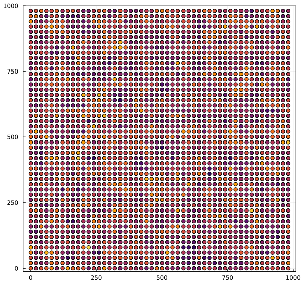

# Overview

This repository contains the experiments of the paper:

*Diamantino et. al. 2023. How difficult is variogram selection with cross-validation?*.

## Instructions

1. Download and install [Julia ≥ v1.8.5](https://julialang.org/downloads/).

2. Open Julia REPL and install [Pluto](https://github.com/fonsp/Pluto.jl):
```julia
julia> import Pkg
julia> Pkg.add("Pluto")
```
3. Clone or download this repository.

4. Launch Pluto:
```julia
julia> import Pluto
julia> Pluto.run()
```
5. Select the notebook of interest:

- `experiment.jl`: cross-validation experiment
- `survey.jl`: post-processing of survey results

## Results

### Deposit 1

#### Regular Samples


